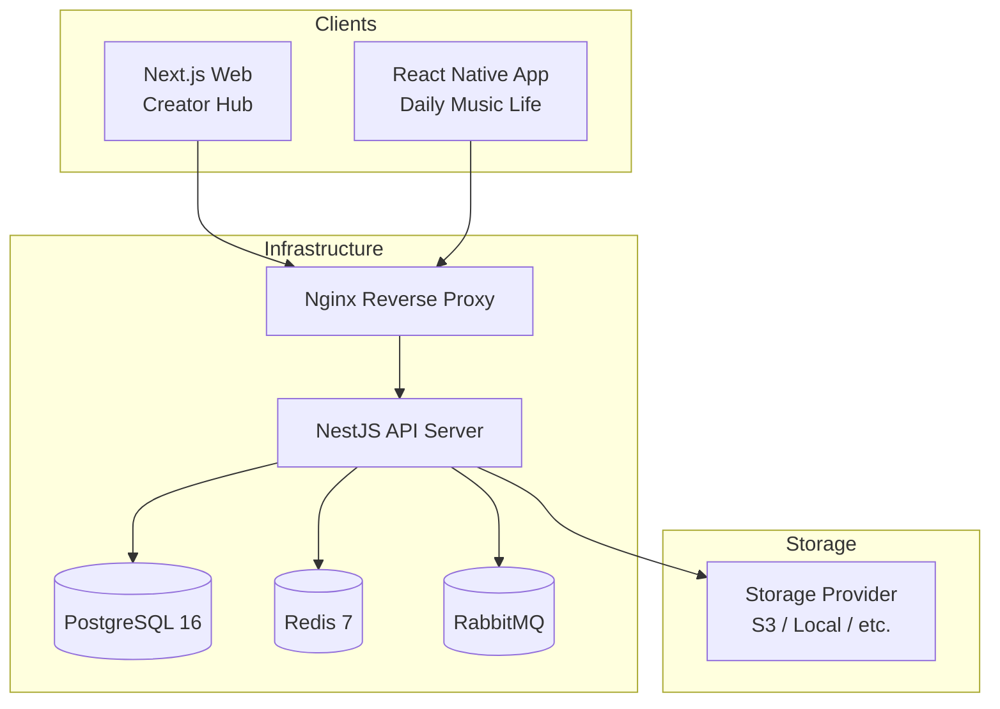
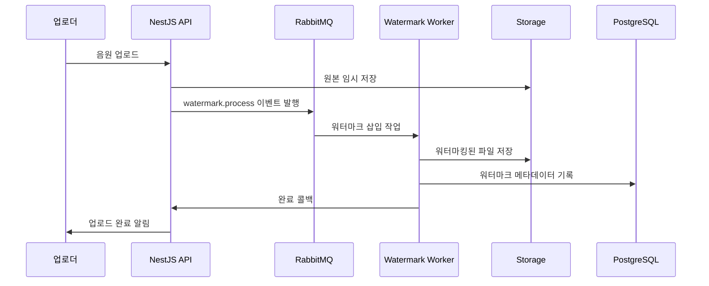
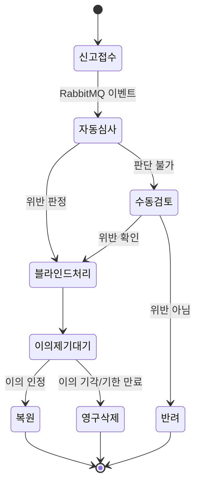

# ARI 기술 아키텍처 (Technical Architecture)

> **Copyright © BZ'NEXA. All rights reserved.**

---

## 1. 시스템 개요

ARI는 AI 음원 창작자를 위한 멀티플랫폼 서비스로, 법적 리스크 방어(OSP 지위, ToS, 워터마킹)를 핵심에 둔 아키텍처입니다.



---

## 2. 기술 스택

| 구분 | 기술 | 버전 |
| :--- | :--- | :--- |
| **Runtime** | Node.js | 20 LTS |
| **Server** | NestJS | 10.x |
| **Web** | Next.js (App Router) | 14.x |
| **App** | React Native (New Arch) | 0.76+ |
| **Database** | PostgreSQL | 16 |
| **Cache** | Redis | 7.x |
| **Message Queue** | RabbitMQ | 3.13+ |
| **ORM** | TypeORM | 0.3.x |
| **Language** | TypeScript | 5.x |
| **Container** | Docker + Docker Compose | Latest |

---

## 3. 모노레포 프로젝트 구조

```
ARI/
├── doc/                          # 기획 및 기술 문서
├── server/                       # NestJS API 서버
│   ├── src/
│   │   ├── main.ts
│   │   ├── app.module.ts
│   │   ├── config/               # 환경설정 모듈
│   │   ├── common/               # 공통 (Guards, Decorators, Filters, Pipes)
│   │   │   ├── guards/
│   │   │   ├── decorators/
│   │   │   ├── filters/
│   │   │   ├── interceptors/
│   │   │   └── pipes/
│   │   ├── auth/                 # 인증 모듈 (JWT + Refresh Token)
│   │   ├── users/                # 사용자 관리
│   │   ├── tracks/               # 음원 관리 (업로드, 메타데이터)
│   │   ├── streaming/            # 오디오 스트리밍
│   │   ├── storage/              # 스토리지 추상화 계층
│   │   ├── watermark/            # AI 워터마킹 모듈
│   │   ├── reports/              # 신고/Notice & Takedown
│   │   ├── charts/               # 차트 시스템 (Phase 2)
│   │   ├── collab/               # 합작 시스템 (Phase 2)
│   │   └── legal/                # 법적 준수 (ToS, 선언, 감사로그)
│   ├── test/
│   ├── Dockerfile
│   ├── package.json
│   └── tsconfig.json
│
├── web/                          # Next.js 웹 (Creator Hub)
│   ├── src/
│   │   ├── app/                  # App Router
│   │   ├── components/
│   │   │   ├── ui/               # 공통 UI 컴포넌트
│   │   │   ├── player/           # 웹 플레이어
│   │   │   ├── chart/            # 차트 뷰
│   │   │   └── studio/           # Artist Studio
│   │   ├── hooks/
│   │   ├── lib/                  # API 클라이언트, 유틸
│   │   ├── styles/               # 글로벌 CSS
│   │   └── types/
│   ├── public/
│   ├── Dockerfile
│   ├── next.config.js
│   └── package.json
│
├── app/                          # React Native 앱 (Daily Music Life)
│   ├── src/
│   │   ├── screens/              # 화면
│   │   ├── components/           # 공통 컴포넌트
│   │   ├── navigation/           # React Navigation
│   │   ├── hooks/
│   │   ├── services/             # API 서비스 레이어
│   │   ├── store/                # 상태 관리 (Zustand)
│   │   ├── theme/                # 스타일시트 기반 테마
│   │   └── types/
│   ├── assets/
│   │   └── fonts/                # Pretendard 폰트
│   ├── android/
│   ├── ios/
│   └── package.json
│
├── docker-compose.yml            # 인프라 + 서버 컨테이너
├── .env.example                  # 환경변수 템플릿
├── .gitignore
└── README.md
```

---

## 4. 인프라 구성 (Docker Compose)

### 컨테이너 구성

| 서비스 | 이미지 | 포트 | 용도 |
| :--- | :--- | :--- | :--- |
| **postgres** | postgres:16-alpine | 5432 | 메인 데이터베이스 |
| **redis** | redis:7-alpine | 6379 | 세션/캐시/Rate Limit |
| **rabbitmq** | rabbitmq:3.13-management-alpine | 5672, 15672 | 비동기 작업 큐 |
| **server** | node:20-alpine (빌드) | 4000 | NestJS API |
| **nginx** | nginx:alpine | 80, 443 | 리버스 프록시 |

### RabbitMQ 큐 설계

| Queue | 용도 |
| :--- | :--- |
| `audio.watermark` | 업로드 후 워터마크 삽입 |
| `audio.encode` | 포맷 변환 (WAV→MP3 등) |
| `notification.push` | 푸시 알림 발송 |
| `report.process` | 신고 자동 블라인드 처리 |
| `chart.aggregate` | 차트 데이터 집계 (Phase 2) |

---

## 5. 인증/보안 설계

> 상세 내용은 `ARI_Security.md` 참조

### JWT Anti-Hijacking 전략

- **Access Token:** 15분 TTL, 메모리 저장 (localStorage 금지)
- **Refresh Token:** 7일 TTL, `httpOnly` + `Secure` + `SameSite=Strict` 쿠키
- **토큰 바인딩:** User-Agent 해시 + IP 대역을 토큰에 포함, 요청 시 검증
- **Refresh Token Rotation:** 갱신 시 이전 토큰 즉시 무효화
- **동시 세션 관리:** Redis 기반 활성 세션 레지스트리

### 소셜 로그인 확장 구조

```typescript
// server/src/auth/strategies/ 디렉토리에 전략 패턴 적용
// 추후 카카오/구글/애플 Strategy만 추가하면 즉시 연동 가능
auth/
├── strategies/
│   ├── jwt.strategy.ts          // 현재 활성
│   ├── jwt-refresh.strategy.ts  // 현재 활성
│   ├── kakao.strategy.ts        // 추후 추가
│   ├── google.strategy.ts       // 추후 추가
│   └── apple.strategy.ts        // 추후 추가
├── guards/
│   ├── jwt-auth.guard.ts
│   └── optional-auth.guard.ts
└── auth.module.ts
```

---

## 6. 스토리지 추상화 계층

스토리지 제공자를 인터페이스로 추상화하여, 어떤 백엔드(로컬/S3/GCS/Azure)로 전환해도 코드 변경 없이 대응합니다.

```typescript
// server/src/storage/storage.interface.ts
export interface IStorageProvider {
  upload(file: Buffer, key: string, mime: string): Promise<string>;
  download(key: string): Promise<Buffer>;
  getSignedUrl(key: string, expiresIn?: number): Promise<string>;
  delete(key: string): Promise<void>;
  exists(key: string): Promise<boolean>;
}
```

- **개발:** `LocalStorageProvider` (로컬 디스크)
- **프로덕션:** `S3StorageProvider` (AWS S3)
- **전환:** `.env`의 `STORAGE_PROVIDER` 값만 변경

---

## 7. AI 워터마킹 모듈

NestJS 내부 모듈로 구현하되, 추후 마이크로서비스 분리가 가능한 구조:



### 워터마크 메타데이터

| 필드 | 설명 |
| :--- | :--- |
| `watermark_id` | 고유 워터마크 식별자 |
| `user_id` | 업로더 ID |
| `track_id` | 음원 ID |
| `fingerprint` | 오디오 핑거프린트 해시 |
| `embedded_at` | 삽입 시각 (UTC) |
| `algorithm_version` | 워터마킹 알고리즘 버전 |

---

## 8. 법적 준수 시스템

`ARI_Platform_Plan.md` 섹션 4 기반:

### OSP 지위 유지

- 플랫폼은 콘텐츠를 직접 제작/편집하지 않음
- 알고리즘 기반 추천만 사용 (편집자 큐레이션 배제)
- 모든 콘텐츠 결정에 대한 감사 로그 기록

### Notice & Takedown 자동화



### 업로드 시 필수 동의 사항

1. 이용약관(ToS) 동의 기록 (버전 포함)
2. AI 생성 콘텐츠 선언 (학습 데이터 출처 명시)
3. 저작권 책임 귀속 확인

---

## 9. 개발 순서 (MVP Roadmap)

| 순서 | 범위 | 대상 |
| :--- | :--- | :--- |
| **Sprint 1** | 프로젝트 초기화, Docker 환경, DB 스키마 | Server |
| **Sprint 2** | 인증 시스템 (JWT + Refresh Token) | Server |
| **Sprint 3** | 음원 업로드 + 워터마킹 + 스트리밍 | Server |
| **Sprint 4** | 신고 시스템 (Notice & Takedown) | Server |
| **Sprint 5** | 앱 기초 (인증, 플레이어, 목록) | App |
| **Sprint 6** | 웹 기초 (Creator Hub, 업로더, 대시보드) | Web |
| **Sprint 7** | 차트 시스템 | Server + App + Web |
