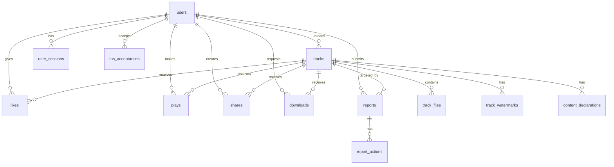

# ARI 데이터베이스 스키마 (DB Schema)

> **Copyright © BZ'NEXA. All rights reserved.**
>
> Database: PostgreSQL 16 | ORM: TypeORM 0.3.x

---

## 1. ERD 개요

---

## 2. 사용자 관련 테이블

### `users` — 사용자 계정

| 컬럼 | 타입 | 제약조건 | 설명 |
| :--- | :--- | :--- | :--- |
| `id` | UUID | PK, DEFAULT uuid_generate_v4() | 고유 식별자 |
| `email` | VARCHAR(255) | UNIQUE, NOT NULL | 이메일 (로그인 ID) |
| `password_hash` | VARCHAR(255) | NOT NULL | bcrypt 해시 |
| `display_name` | VARCHAR(50) | NOT NULL | 표시 이름 (아티스트명) |
| `bio` | TEXT | NULLABLE | 자기소개 |
| `avatar_url` | VARCHAR(500) | NULLABLE | 프로필 이미지 URL |
| `role` | ENUM | DEFAULT 'user' | user / artist / admin |
| `is_verified` | BOOLEAN | DEFAULT false | 이메일 인증 여부 |
| `is_active` | BOOLEAN | DEFAULT true | 계정 활성 상태 |
| `social_provider` | VARCHAR(20) | NULLABLE | 소셜 로그인 제공자 |
| `social_id` | VARCHAR(255) | NULLABLE | 소셜 로그인 ID |
| `last_login_at` | TIMESTAMPTZ | NULLABLE | 마지막 로그인 |
| `created_at` | TIMESTAMPTZ | DEFAULT NOW() | 가입일 |
| `updated_at` | TIMESTAMPTZ | DEFAULT NOW() | 수정일 |

**인덱스:** `idx_users_email`, `idx_users_social`

---

### `user_sessions` — 활성 세션 (토큰 관리)

| 컬럼 | 타입 | 제약조건 | 설명 |
| :--- | :--- | :--- | :--- |
| `id` | UUID | PK | 세션 ID |
| `user_id` | UUID | FK → users.id, NOT NULL | 사용자 |
| `refresh_token_hash` | VARCHAR(255) | NOT NULL | Refresh Token 해시 |
| `user_agent_hash` | VARCHAR(64) | NOT NULL | UA 해시 (바인딩) |
| `ip_address` | VARCHAR(45) | NOT NULL | 접속 IP |
| `device_name` | VARCHAR(100) | NULLABLE | 디바이스 이름 |
| `is_revoked` | BOOLEAN | DEFAULT false | 폐기 여부 |
| `expires_at` | TIMESTAMPTZ | NOT NULL | 만료 시각 |
| `created_at` | TIMESTAMPTZ | DEFAULT NOW() | 생성일 |

**인덱스:** `idx_sessions_user`, `idx_sessions_token`

---

## 3. 음원 관련 테이블

### `tracks` — 음원 메타데이터

| 컬럼 | 타입 | 제약조건 | 설명 |
| :--- | :--- | :--- | :--- |
| `id` | UUID | PK | 음원 ID |
| `user_id` | UUID | FK → users.id, NOT NULL | 업로더 |
| `title` | VARCHAR(200) | NOT NULL | 곡 제목 |
| `description` | TEXT | NULLABLE | 곡 설명 |
| `genre` | VARCHAR(50) | NOT NULL | 장르 |
| `mood` | VARCHAR(50) | NULLABLE | 분위기 태그 |
| `tags` | VARCHAR(500) | NULLABLE | 쉼표 구분 태그 |
| `duration_sec` | INTEGER | NOT NULL | 재생 시간 (초) |
| `bpm` | INTEGER | NULLABLE | BPM |
| `key_signature` | VARCHAR(10) | NULLABLE | 조성 |
| `cover_image_url` | VARCHAR(500) | NULLABLE | 커버 이미지 URL |
| `is_public` | BOOLEAN | DEFAULT true | 공개 여부 |
| `is_blinded` | BOOLEAN | DEFAULT false | 신고 블라인드 여부 |
| `play_count` | BIGINT | DEFAULT 0 | 총 재생 수 |
| `like_count` | INTEGER | DEFAULT 0 | 좋아요 수 |
| `share_count` | INTEGER | DEFAULT 0 | 공유 수 |
| `download_count` | INTEGER | DEFAULT 0 | 다운로드 수 |
| `ai_model_used` | VARCHAR(100) | NULLABLE | 사용 AI 모델명 |
| `created_at` | TIMESTAMPTZ | DEFAULT NOW() | 업로드일 |
| `updated_at` | TIMESTAMPTZ | DEFAULT NOW() | 수정일 |

**인덱스:** `idx_tracks_user`, `idx_tracks_genre_mood`, `idx_tracks_public`, `idx_tracks_created`

---

### `track_files` — 음원 파일 (다중 포맷)

| 컬럼 | 타입 | 제약조건 | 설명 |
| :--- | :--- | :--- | :--- |
| `id` | UUID | PK | 파일 ID |
| `track_id` | UUID | FK → tracks.id, NOT NULL | 소속 음원 |
| `file_type` | ENUM | NOT NULL | original / compressed / stem |
| `format` | VARCHAR(10) | NOT NULL | wav, flac, mp3, ogg |
| `storage_key` | VARCHAR(500) | NOT NULL | 스토리지 경로/키 |
| `file_size_bytes` | BIGINT | NOT NULL | 파일 크기 |
| `bitrate` | INTEGER | NULLABLE | 비트레이트 (kbps) |
| `sample_rate` | INTEGER | NULLABLE | 샘플레이트 (Hz) |
| `stem_label` | VARCHAR(50) | NULLABLE | 스템 라벨 (vocals, drums 등) |
| `is_watermarked` | BOOLEAN | DEFAULT false | 워터마크 삽입 여부 |
| `created_at` | TIMESTAMPTZ | DEFAULT NOW() | 생성일 |

---

### `track_watermarks` — 워터마크 메타데이터

| 컬럼 | 타입 | 제약조건 | 설명 |
| :--- | :--- | :--- | :--- |
| `id` | UUID | PK | 워터마크 ID |
| `track_id` | UUID | FK → tracks.id | 대상 음원 |
| `user_id` | UUID | FK → users.id | 업로더 |
| `fingerprint` | VARCHAR(255) | NOT NULL | 오디오 핑거프린트 해시 |
| `algorithm_version` | VARCHAR(20) | NOT NULL | 알고리즘 버전 |
| `embedded_at` | TIMESTAMPTZ | DEFAULT NOW() | 삽입 시각 |

---

## 4. 활동 관련 테이블

### `plays` — 재생 기록

| 컬럼 | 타입 | 설명 |
| :--- | :--- | :--- |
| `id` | UUID (PK) | |
| `track_id` | UUID (FK) | 재생된 음원 |
| `user_id` | UUID (FK, NULLABLE) | 비로그인 가능 |
| `duration_listened` | INTEGER | 실제 청취 시간(초) |
| `ip_hash` | VARCHAR(64) | 어뷰징 방지 |
| `played_at` | TIMESTAMPTZ | 재생 시각 |

### `likes` — 좋아요

| 컬럼 | 타입 | 설명 |
| :--- | :--- | :--- |
| `user_id` | UUID (PK, FK) | |
| `track_id` | UUID (PK, FK) | |
| `created_at` | TIMESTAMPTZ | |

**Composite PK:** (user_id, track_id)

### `shares` — 공유 기록

| 컬럼 | 타입 | 설명 |
| :--- | :--- | :--- |
| `id` | UUID (PK) | |
| `track_id` | UUID (FK) | |
| `user_id` | UUID (FK) | |
| `platform` | VARCHAR(20) | 공유 대상 (link, kakao, twitter 등) |
| `created_at` | TIMESTAMPTZ | |

### `downloads` — 다운로드 (Pocket MP3)

| 컬럼 | 타입 | 설명 |
| :--- | :--- | :--- |
| `id` | UUID (PK) | |
| `track_id` | UUID (FK) | |
| `user_id` | UUID (FK) | |
| `file_format` | VARCHAR(10) | mp3 / flac |
| `downloaded_at` | TIMESTAMPTZ | |

---

## 5. 법적 준수 테이블

### `reports` — 신고 (Notice & Takedown)

| 컬럼 | 타입 | 설명 |
| :--- | :--- | :--- |
| `id` | UUID (PK) | |
| `reporter_id` | UUID (FK → users) | 신고자 |
| `track_id` | UUID (FK → tracks) | 신고 대상 |
| `reason` | ENUM | copyright / inappropriate / fraud / other |
| `description` | TEXT | 상세 내용 |
| `evidence_urls` | TEXT[] | 증거 자료 URL 배열 |
| `status` | ENUM | pending / reviewing / blinded / rejected / resolved |
| `created_at` | TIMESTAMPTZ | 신고 시각 |
| `updated_at` | TIMESTAMPTZ | 상태 변경 시각 |

### `report_actions` — 신고 처리 이력

| 컬럼 | 타입 | 설명 |
| :--- | :--- | :--- |
| `id` | UUID (PK) | |
| `report_id` | UUID (FK → reports) | |
| `action_by` | UUID (FK → users) | 처리자 (admin) |
| `action_type` | ENUM | blind / restore / delete / reject |
| `note` | TEXT | 처리 사유 |
| `created_at` | TIMESTAMPTZ | 처리 시각 |

### `tos_acceptances` — 이용약관 동의 기록

| 컬럼 | 타입 | 설명 |
| :--- | :--- | :--- |
| `id` | UUID (PK) | |
| `user_id` | UUID (FK) | |
| `tos_version` | VARCHAR(20) | 약관 버전 |
| `accepted_at` | TIMESTAMPTZ | 동의 시각 |
| `ip_address` | VARCHAR(45) | 동의 시 IP |

### `content_declarations` — AI 콘텐츠 선언

| 컬럼 | 타입 | 설명 |
| :--- | :--- | :--- |
| `id` | UUID (PK) | |
| `track_id` | UUID (FK) | |
| `user_id` | UUID (FK) | |
| `ai_model` | VARCHAR(100) | 사용 AI 모델 |
| `training_data_source` | TEXT | 학습 데이터 출처 설명 |
| `is_fully_ai` | BOOLEAN | 100% AI 여부 |
| `human_contribution` | TEXT | 사람의 기여 내용 |
| `declared_at` | TIMESTAMPTZ | 선언 시각 |

### `audit_logs` — 감사 로그

| 컬럼 | 타입 | 설명 |
| :--- | :--- | :--- |
| `id` | UUID (PK) | |
| `user_id` | UUID (FK, NULLABLE) | 시스템 액션 시 NULL |
| `action` | VARCHAR(100) | 행위 (upload, delete, blind 등) |
| `entity_type` | VARCHAR(50) | 대상 엔티티 (track, report 등) |
| `entity_id` | UUID | 대상 ID |
| `details` | JSONB | 변경 상세 내용 |
| `ip_address` | VARCHAR(45) | 요청 IP |
| `created_at` | TIMESTAMPTZ | 기록 시각 |

**인덱스:** `idx_audit_user`, `idx_audit_entity`, `idx_audit_created`

---

## 6. 향후 확장 테이블 (Phase 2)

> 차트 시스템 및 합작 시스템 구현 시 추가 예정

- `chart_snapshots` — 시간별 차트 스냅샷
- `collaborations` — 합작 요청/수락
- `collab_tracks` — 합작 결과물
- `revenue_splits` — 수익 분배 설정
- `subscriptions` — ARI Pass 구독 관리
