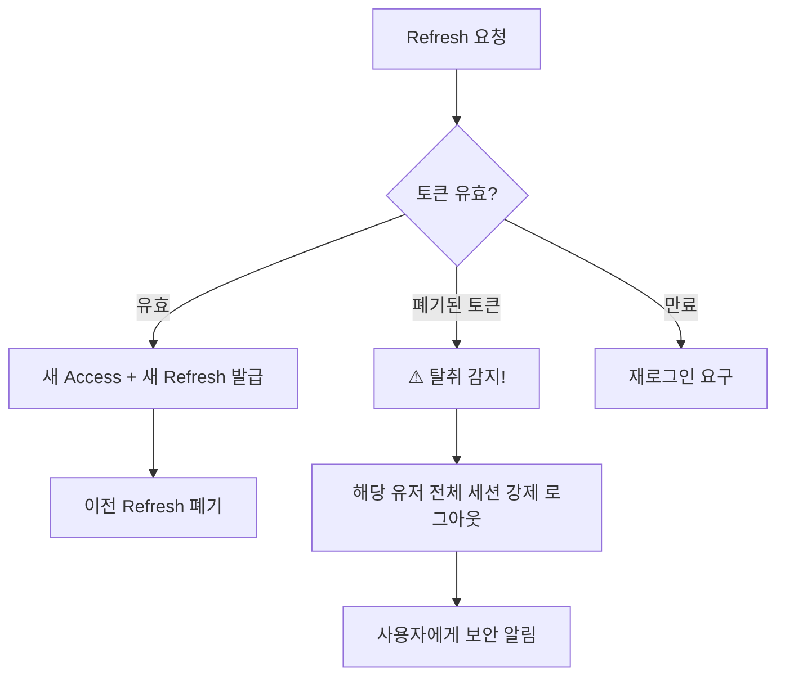

# ARI 보안 전략 (Security Strategy)

> **Copyright © BZ'NEXA. All rights reserved.**

---

## 1. 인증 보안 (JWT Anti-Hijacking)

### 토큰 구조

```
┌─────────────────────────────────────────────────┐
│  Access Token (JWT)                             │
│  ─ TTL: 15분                                    │
│  ─ 저장: 메모리 (React state / Zustand)         │
│  ─ Payload: userId, role, uaHash, ipRange       │
│  ─ 용도: API 요청 인증                          │
├─────────────────────────────────────────────────┤
│  Refresh Token (Opaque UUID)                    │
│  ─ TTL: 7일                                     │
│  ─ 저장: httpOnly + Secure + SameSite=Strict    │
│  ─ DB: user_sessions 테이블에 해시 저장         │
│  ─ 용도: Access Token 재발급 전용               │
└─────────────────────────────────────────────────┘
```

### Anti-Hijacking 체크리스트

| 방어 기법 | 구현 방법 |
| :--- | :--- |
| **토큰 바인딩** | Access Token에 `uaHash`(User-Agent SHA-256)와 `ipRange`(/24 대역) 포함. 요청 시 일치 여부 검증 |
| **Refresh Rotation** | 갱신 시 새 Refresh Token 발급, 이전 토큰 즉시 폐기. 폐기된 토큰 사용 감지 시 해당 유저의 모든 세션 강제 로그아웃 |
| **쿠키 보안** | `httpOnly` (JS 접근 차단), `Secure` (HTTPS 전용), `SameSite=Strict` (CSRF 방지) |
| **세션 레지스트리** | Redis에 활성 세션 관리, 비정상 패턴 감지 시 즉시 무효화 |
| **Rate Limiting** | 로그인: 5회/분, 토큰 갱신: 10회/분 (IP 기준) |

### Refresh Token Reuse Detection



---

## 2. 데이터 보안

### 암호화

| 대상 | 방식 |
| :--- | :--- |
| **비밀번호** | bcrypt (salt rounds: 12) |
| **Refresh Token 저장** | SHA-256 해시 |
| **전송** | TLS 1.3 (HTTPS) |
| **민감 환경변수** | Docker Secrets 또는 환경변수 암호화 |

### 입력 검증

- **NestJS Pipes:** `class-validator` + `class-transformer` 전역 적용
- **SQL Injection:** TypeORM 파라미터 바인딩 (raw query 사용 금지)
- **XSS:** 입력값 sanitize, CSP 헤더 설정
- **파일 업로드:** MIME 타입 + Magic Bytes 이중 검증

---

## 3. 법적 방어 보안

> `ARI_Platform_Plan.md` 4장 기반

### OSP(온라인 서비스 제공자) 지위 유지

- **자동화 원칙:** 콘텐츠 추천/정렬은 100% 알고리즘 기반
- **편집 개입 금지:** 운영자가 특정 콘텐츠를 수동으로 밀어주는 행위 금지
- **로그 기록:** 모든 콘텐츠 노출 결정에 대한 `audit_logs` 기록

### Notice & Takedown 보안

- 신고 접수 → 24시간 이내 1차 대응 (자동 or 수동)
- 블라인드 처리 시 업로더에게 즉시 알림 + 이의제기 안내
- 이의제기 기한: 7일 (기한 내 미응답 시 영구 삭제)
- 모든 처리 과정 `report_actions`에 기록 (법적 증거)

### 포렌식 추적

- 모든 다운로드에 사용자별 고유 워터마크 삽입
- 유출 감지 시 워터마크 추출 → `track_watermarks` 조회 → 최초 유출자 특정
- 감사 로그 보존 기간: 최소 5년

---

## 4. 인프라 보안

### Docker 보안

- 비root 유저로 컨테이너 실행
- 불필요한 포트 외부 노출 금지 (DB, Redis, RabbitMQ는 내부 네트워크만)
- 이미지 태그 고정 (`:latest` 사용 금지)

### API 보안 헤더 (Helmet.js)

```
X-Content-Type-Options: nosniff
X-Frame-Options: DENY
X-XSS-Protection: 1; mode=block
Strict-Transport-Security: max-age=31536000; includeSubDomains
Content-Security-Policy: default-src 'self'
```

### CORS 설정

```typescript
// 허용 오리진을 환경변수로 관리
{
  origin: process.env.CORS_ORIGINS?.split(','),
  credentials: true, // Refresh Token 쿠키 전송 허용
  methods: ['GET', 'POST', 'PATCH', 'DELETE'],
}
```

---

## 5. 소셜 로그인 확장 가이드

추후 소셜 로그인 추가 시 아래 절차만 수행:

1. `server/src/auth/strategies/`에 새 Strategy 파일 추가
2. 해당 OAuth Provider의 Client ID/Secret을 `.env`에 추가
3. `auth.module.ts`에 Strategy 등록
4. `auth.controller.ts`에 콜백 라우트 추가

```typescript
// 예시: kakao.strategy.ts
@Injectable()
export class KakaoStrategy extends PassportStrategy(Strategy, 'kakao') {
  constructor(private configService: ConfigService) {
    super({
      clientID: configService.get('KAKAO_CLIENT_ID'),
      callbackURL: configService.get('KAKAO_CALLBACK_URL'),
    });
  }

  async validate(accessToken: string, profile: any) {
    // 소셜 계정 → users 테이블 매핑 로직
  }
}
```
